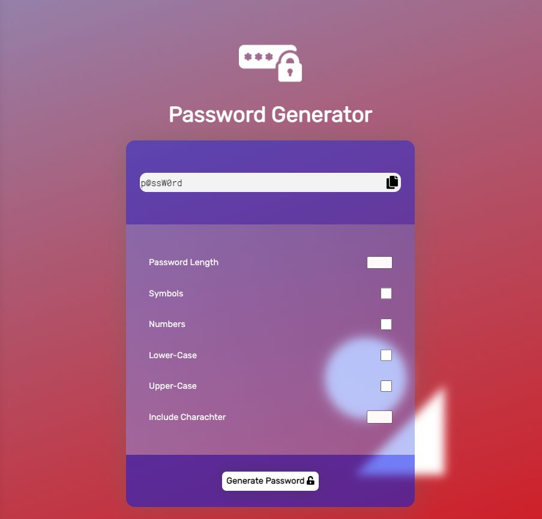

# 3-Password-Generator

a tool that allows you to generate a randomized password between 8 - 128 characters long using numeric, symbol and letter values.

Use:
this tool uses javascript to randomize and generate and string of characters dependent on user selection. 

- select length of password
- select which characters you would like to include in your password.
- type special character if desired 
- click generate password. 
- once generated, clicking the copy button will copy your password to your clipboard.

Screens grab of the password generator.

